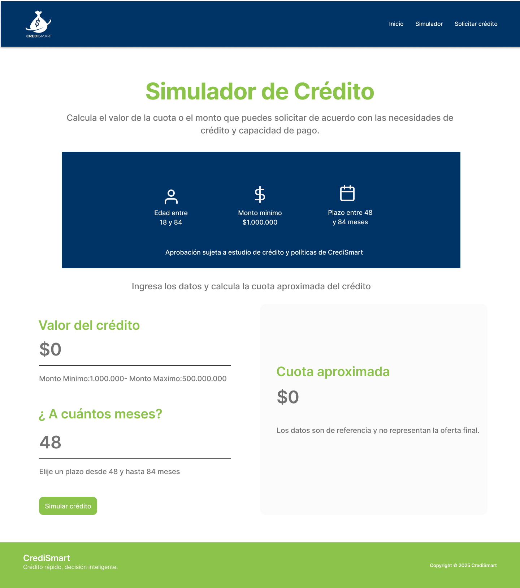

💳✨ **CrediSmart – Simulador de Crédito (Versión React)**

👩‍💻 **Desarrollado por:**

Monica Duque Posso

📝 **Descripción del proyecto**

Este proyecto es una versión modernizada y optimizada del sitio web de CrediSmart, creada utilizando React + Vite.

Tiene como objetivo mostrar productos crediticios, permitir al usuario simular su crédito y llenar un formulario de solicitud, todo dentro de una experiencia web dinámica, rápida y profesional.

✨ **Características principales**

🏠 Página de inicio con productos crediticios

🧮 Simulador de crédito con cálculo automático

🎚️ Control deslizante (range) para elegir meses

📝 Formulario de solicitud de crédito

🔗 Navegación dinámica con React Router

🎨 Estilos personalizados + Bootstrap 5

📦 Componentes reutilizables (Navbar, Footer, Cards...)

🚀 **Tecnologías Utilizadas**
Tecnología	Descripción
⚛️ React	UI basada en componentes
🚀 Vite	Bundler rápido para desarrollo
🔀 React Router DOM	Navegación entre páginas
🎨 Bootstrap 5	Estilos rápidos y responsivos
🖌️ CSS Personalizado	Diseño propio del proyecto

📁 **Estructura del proyecto**
CrediSmart/
│
├── src/
│   ├── components/
│   │   ├── Navbar.jsx
│   │   ├── Hero.jsx
│   │   ├── Footer.jsx
│   │   ├── ProductCard.jsx
│   │   └── ...
│   │
│   ├── pages/
│   │   ├── Home.jsx
│   │   ├── Simulador.jsx
│   │   └── SolicitarCredito.jsx
│   │
│   ├── App.jsx
│   ├── main.jsx
│   └── index.css
│
├── package.json
└── vite.config.js

⚙️ **Cómo ejecutar el proyecto**

1️⃣ Clonar el repositorio
git clone https://github.com/monicaduque-iudigital/credismart-act-2.git

2️⃣ Ingresar a la carpeta
cd credismart-act-2

3️⃣ Instalar dependencias
npm install

4️⃣ Ejecutar en modo desarrollo
npm run dev

5️⃣ Abrir en el navegador

🎨 **Diseño del Simulador**

Inputs con validación

1️⃣ Formato dinámico de moneda

2️⃣ Slider que ajusta los meses y recalcula la cuota

3️⃣ Tarjeta de resultado en tiempo real

5️⃣ Cálculo basado en fórmula de crédito tradicional

📸 **Capturas de pantalla**
### 🏠 Página de inicio

---

### 💰 Simulador de crédito

---

### 📝 Solicitud de crédito

📄 **Licencia**
Este proyecto es solo para fines educativos (IU Digital – Ingeniería Web).
